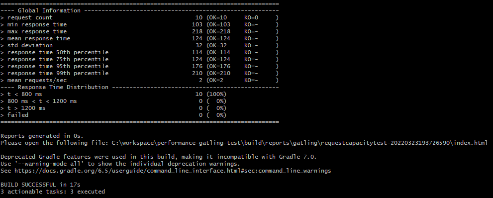
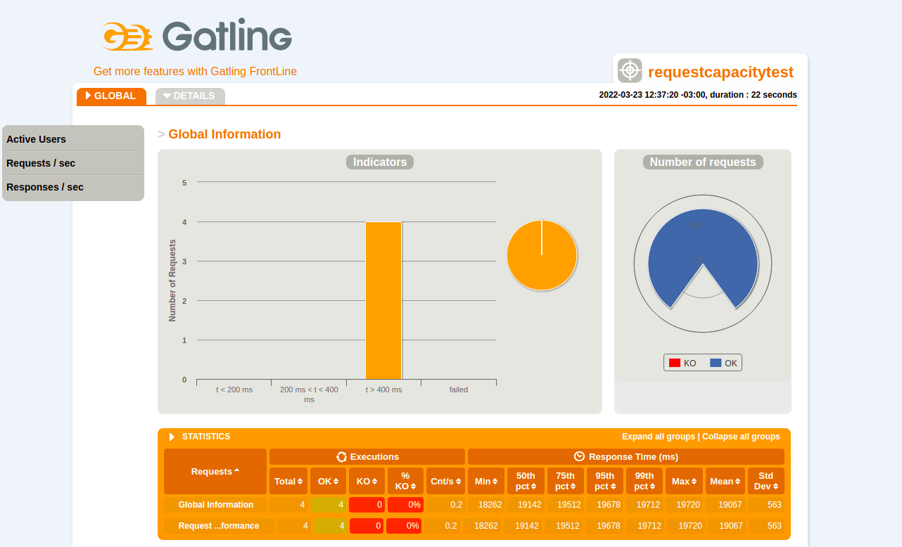

# performance-gatling-test
**Utilização do framework gatling em linguagem scala para criaçao de scripts de teste de carga e stress.**

- *Pré requisitos*:
    - Instalar Plugin Scala no IntelliJ: `File` > `Settings` > `Plugins` > `Scala`
    - [Configuração JVM](https://gatling.io/docs/current/installation#intellij-idea): `File` > `Settings` > `Scala Compile Server`: `JVM Options` = `-server -Xss100M`
    - Importar o projeto no IntelliJ como projeto gradle
    - SDK JAVA: Java 8
      - Alternar entre versões java instaladas:
        ```sudo update-alternatives --config java```
    - SDK SCALA: 2.13.6 para cima
      - Adicionar o plugin o proprio IntelliJ


- *Executar testes pelo IntelliJ*:
    - Na classe GatlingRunner colocar a classe a ser executada
    - Botão direito em main > Run > GatlingRunner
        - Após isso na paleta de execução onde está `GatlingRunner` clicar e selecionar `Edit Configurations`
        - Em `Environment variables` adicionar `ENV=ambiente`
        - Clicar em Run na paleta de execução

    - Obs.: ambientes configurados(`main` > `scala` > `configuration` > `Profile`): `ambiente`

### Cenário de Exemplo
Requisição GET para o serviço **Test your front-end against a real API** https://reqres.in/
Endpont: **/api/users**

- *Executar testes por linha de comando usando Java 8*:
```ENV=ambiente ./gradlew clean gatlingRun-test.RequestCapacityTest```


- *Executar testes por linha de comando passando parâmetros*:
```ENV=ambiente ./gradlew clean gatlingRun-test.RequestCapacityTest -DtotalUsers=2 -DrampDuration=2```

    

Parametros:
- **-DtotalUsers=2** (Quantidade de usuários simulados)
- **-DrampDuration=2** (Duração do teste em segundos)
- **-DinitialUsersQtt** (Numero inicial de usuários)

OBS: Todos parâmetros são opcionais caso não seja passado o valor default será 3.

### Relatório gatling
É gerado um reports ***index.html***
> performance-gatling-test/build/reports/gatling/requestcapacitytest/index.html


### Analise de Código
Projeto configurado no sonarCloud
* [Sonar Cloud](https://sonarcloud.io/project/overview?id=diegomachadoti_performance-gatling-test)

### Referências

- [Gatling](https://gatling.io/)
- [Gatling Cheat Sheet](https://gatling.io/docs/current/cheat-sheet/)
- [Gatling Plugin for Gradle](https://github.com/lkishalmi/gradle-gatling-plugin)
